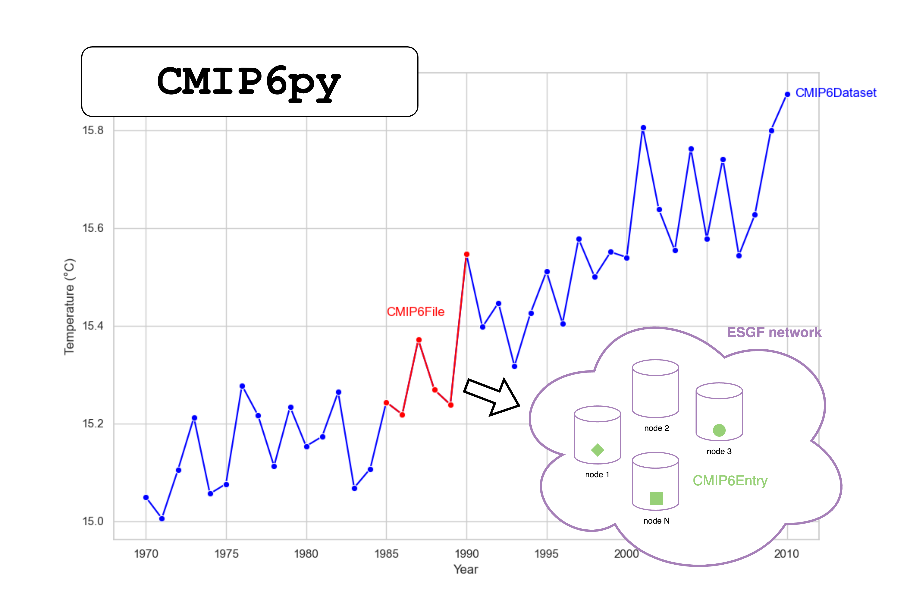

# CMIP6py: a python package for CMIP6 data

CMIP6py allows to interact with CMIP6 data stored on ESGF nodes with python. More specifically, it allows:
1. Open search of CMIP6 data on ESGF nodes
2. Filtering and visualising CMIP6 data from ESGF nodes
3. Download CMIP6 data from ESGF nodes

The ESGF network can be somewhat unstable with nodes going offline and data becoming unreachable. CMIP6Py alleviates that issue by allowing to filter, almost in real-time, the running ESGF nodes. This allows to easily locate data on the network and donwload it safely without worrying about network status or duplicated data.

## Idea

The package is centered around three nested classes:
- `cmip6py.data.dataset.CMIP6Dataset`: Stores an entire dataset, i.e. model/experiment/member/variable for a given time period. Internally, it maintains a list of `cmip6.data.file.CMIP6File`s.
- `cmip6.data.CMIP6File`: Stores a single file within a dataset, i.e. model/experiment/member/variable spanning a time period contained in a larger dataset. Internally, it maintains a list of equivalent `cmip6py.data.entry.CMIP6Entry`s.
- `cmip6py.data.entry.CMIP6Entry`: Stores  a single instance of a given file that exist on an ESGF node. Entries are considered equivalent when they represent the same data with possible differences in the gridding (i.e. `table_id` and `grid_label` ESGF facets) and version (we might as well download a slighlty older version than nothing).



The entry point class is `CMIP6py.search.cmip6_search.CMIP6Search`, which allows to search ESGF network for any CMIP6 data. It leverages `CMIP6Dataset`s internally and provides additional functionalities such as filtering, balancing, visualisation and download. 

## Examples

Below is a basic CMIP6py workflow:
```python
>>> from cmip6py.search.cmip6_search import search

# defined search facets
>>> search_facets = {"experiment_id": ["historical", "ssp245"], "source_id": ["EC-Earth3", "MPI-ESM1-2-HR"], "variable": ["ua", "va"], "table_id": ["Eday", "day", "Oday"]}

# create a CMIP6Search object and perform search
>>> cmip6_search = search(search_facets, random_seed=43, max_workers=12)
>>> cmip6_search
'CMIP6Search:random_seed=43,n_datasets=368,nodes_are_filtered=False,members_are_balanced=False'

# filter variable set such that all configurations (i.e. combinations of source_id,experiment_id,member_id) have exactly the same set of variables
>>> cmip6_search = cmip6_search.strict_variable_set(variable_set=["ua", "va"])
>>> cmip6_search # for this example every configuration are valid
'CMIP6Search:random_seed=43,n_datasets=368,nodes_are_filtered=False,members_are_balanced=False'

# explore nested structure
>>> cmip6_search.datasets[0]
'CMIP6Dataset:EC-Earth3_historical_r101i1p1f1_ua_19700101-20141231'
>>> cmip6_search.datasets[0].files[0]
'CMIP6File:EC-Earth3_historical_r101i1p1f1_ua_19700101-19701231'
>>> cmip6_search.datasets[0].files[0].entries[0]
'CMIP6Entry:ua_day_EC-Earth3_historical_r101i1p1f1_gr_19700101-19701231|esg-dn1.nsc.liu.se'

# plot members distribution
>>> cmip6_search.summary_plot()

# apply filtering
>>> filtered_cmip6_search = (cmip6_search.filter("facets", experiment_id=["historical", "ssp245"]) # only historical and SSP-2.45
                                         .filter("years", historical=[2010, 2015], projections=[2015, 2021])) # select years
>>> filtered_cmip6_search
'CMIP6Search:random_seed=43,n_datasets=368,nodes_are_filtered=True,members_are_balanced=False'

# filter nodes
>>> avail_cmip6_search = filtered_cmip6_search.filter("running_nodes")
>>> avail_cmip6_search
'CMIP6Search:random_seed=43,n_datasets=368,nodes_are_filtered=True,members_are_balanced=False'

# balance members 
>>> avail_balanced_cmip6_search = avail_cmip6_search.balance_members(num_members=4, tolerance=2)
>>> avail_balanced_cmip6_search.summary_plot()
>>> avail_balanced_cmip6_search
'CMIP6Search:random_seed=43,n_datasets=22,nodes_are_filtered=True,members_are_balanced=True'

# download
>>> avail_balanced_cmip6_search.download("cmip6_data/")
>>> avail_balanced_cmip6_search.dataset_to_local_files
{
  "EC-Earth3_historical_r113i1p1f1_ua_20100101-20141231": [
    "cmip6_data/CMIP6/CMIP/EC-Earth3/historical/r113i1p1f1/day/ua/v20200412/ua_day_EC-Earth3_historical_r113i1p1f1_gr_20100101-20101231.nc",
    ...,
    "cmip6_data/CMIP6/CMIP/EC-Earth3/historical/r113i1p1f1/day/ua/v20200412/ua_day_EC-Earth3_historical_r113i1p1f1_gr_20140101-20141231.nc"
  ],
  "EC-Earth3_historical_r22i1p1f1_ua_20100101-20141231": [
    "cmip6_data/CMIP6/CMIP/EC-Earth3/historical/r22i1p1f1/day/ua/v20210527/ua_day_EC-Earth3_historical_r22i1p1f1_gr_20100101-20101231.nc",
    ...,
    "cmip6_data/CMIP6/CMIP/EC-Earth3/historical/r22i1p1f1/day/ua/v20210527/ua_day_EC-Earth3_historical_r22i1p1f1_gr_20140101-20141231.nc"
  ],
  ...,
  "MPI-ESM1-2-HR_ssp245_r1i1p1f1_va_20150101-20241231": [
    "cmip6_data/CMIP6/ScenarioMIP/MPI-ESM1-2-HR/ssp245/r1i1p1f1/Eday/va/v20190710/va_Eday_MPI-ESM1-2-HR_ssp245_r1i1p1f1_gn_20150101-20191231.nc",
    "...",
    "cmip6_data/CMIP6/ScenarioMIP/MPI-ESM1-2-HR/ssp245/r1i1p1f1/Eday/va/v20190710/va_Eday_MPI-ESM1-2-HR_ssp245_r1i1p1f1_gn_20200101-20241231.nc"
  ]
}
```

`CMIP6Search` objects can also be splitted by dataset facets to be processed in parallel. This is particularly useful to build parallel data processing pipelines once the datasets have been downloaded.

```python
>>> avail_cmip6_search.splitby(["source_id", "experiment_id"])
['CMIP6Search:random_seed=43,n_datasets=6,nodes_are_filtered=True,members_are_balanced=True',
 'CMIP6Search:random_seed=43,n_datasets=6,nodes_are_filtered=True,members_are_balanced=True',
 'CMIP6Search:random_seed=43,n_datasets=6,nodes_are_filtered=True,members_are_balanced=True',
 'CMIP6Search:random_seed=43,n_datasets=4,nodes_are_filtered=True,members_are_balanced=True']
```

## Installation

Clone this repository and run
```
pip install -e .
```

## Troubleshooting

**Playwright Sync / Async API in Jupyter notebooks**

This error shows up when running `cmip6py.esgf_network.analytics.get_esgf_nodes_status()` from a jupyter notebook. Run the command in the termninal first to load the status file in cache. You can use the `init_esgf_nodes.py` script for that.
```
Error: It looks like you are using Playwright Sync API inside the asyncio loop.
Please use the Async API instead.
```


<!-- **`cmip6py.data.file.CMIP6File`**

This class ensures that we do not lose any data. A `CMIP6File` contains all equivalent CMIP6 files on ESGF, i.e. files that have the same `source_id`, `experiment_id`, `member_id`, `variable`, `start_date`, and `end_date`. Other facets may differ. The equivalent files informations are stored in a dataframe.
```
cmip6_file.name 
>>> {source_id}_{experiment_id}_{member_id}_{variable}_{start_date}-{end_date}

cmip6_file.df
>>> pd.DataFrame({
    source_id: ...,
    experiment_id: ...,
    member_id: ...,
    variable: ...,
    start_date: ...,
    end_date: ...,
    varying_facet-1: ...,
    varying_facet-2: ...,
    ...,
    varying_facet-N: ...,
    urls: ..., # all download urls associated to each file -> used for downloading
    data_nodes: ..., # all hosts associated to each file -> used for filtering runnning nodes
    checksums: ..., # all checksums associated to each file -> used to validate downloads
})
```

**`cmip6py.data.file.CMIP6Dataset`**

This class contains all `CMIP6File`s that have the same `source_id`, `experiment_id`, `member_id`, `variable` but different `start_date`, `end_date`.
```
cmip6_file.name 
>>> {source_id}_{experiment_id}_{member_id}_{variable}_{dataset_start_date}-{dataset_end_date}

cmip6_file.df
>>> pd.DataFrame({
    source_id: ...,
    experiment_id: ...,
    member_id: ...,
    variable: ...,
    dataset_start_date: ...,
    dataset_end_date: ...,
    varying_facet-1: ...,
    varying_facet-2: ...,
    ...,
    varying_facet-N: ...,
    urls: ..., # all download urls associated to each file -> used for downloading
    data_nodes: ..., # all hosts associated to each file -> used for filtering runnning nodes
    checksums: ..., # all checksums associated to each file -> used to validate downloads
})
```

## Functionalities

The main entrypoint is `cmip6py.open_search.CMIP6OpenSearch`. It allows to store search results, filter them and download them easily.

### Exploring  -->

