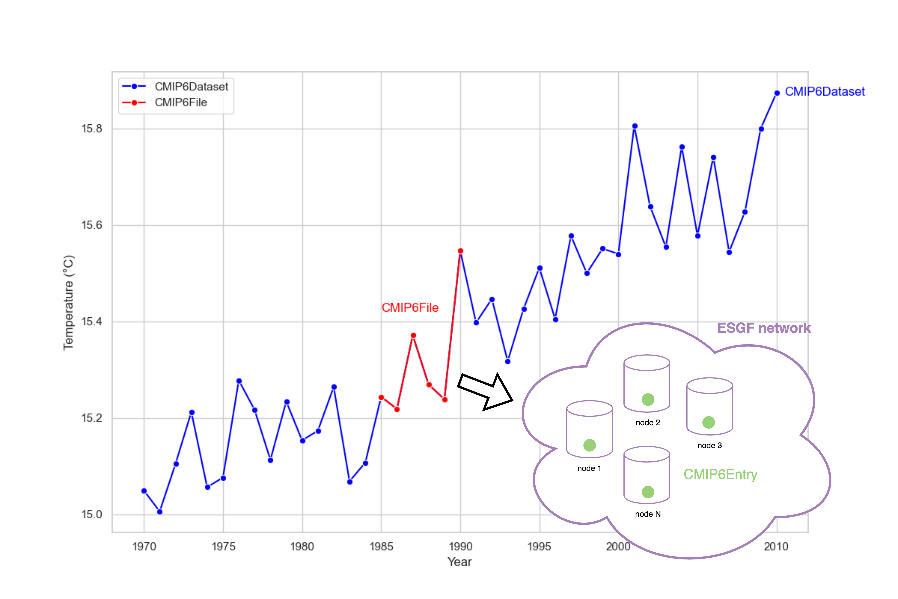

# CMIP6py: a python package for CMIP6 data

CMIP6py allows to interact with CMIP6 data stored on ESGF nodes with python. More specifically, it allows:
1. Open search of CMIP6 data on ESGF nodes
2. Filtering and visualising CMIP6 data from ESGF nodes
3. Download CMIP6 data from ESGF nodes

## Idea

The package is centered around three nested classes:
- `cmip6py.data.dataset.CMIP6Dataset`: Stores an entire dataset, i.e. model/experiment/member/variable for a given time period. Internally, it maintains a list of `cmip6.data.file.CMIP6File`s.
- `cmip6.data.CMIP6File`: Stores a single file within a dataset, i.e. model/experiment/member/variable spanning a time period contained in a larger dataset. Internally, it maintains a list of `cmip6py.data.file.CMIP6Entry`s. 
- `cmip6py.data.file.CMIP6Entry`: Stores all the instances of a given file that exist on the nodes of the ESGF network. 



The entry point class is `CMIP6py.search.cmip6_search.CMIP6Search`, which allows to search ESGF network for any CMIP6 data. It leverages `CMIP6Dataset`s internally and provides additional functionalities such as filtering, balancing, visualisation and download. 


<!-- **`cmip6py.data.file.CMIP6File`**

This class ensures that we do not lose any data. A `CMIP6File` contains all equivalent CMIP6 files on ESGF, i.e. files that have the same `source_id`, `experiment_id`, `member_id`, `variable`, `start_date`, and `end_date`. Other facets may differ. The equivalent files informations are stored in a dataframe.
```
cmip6_file.name 
>>> {source_id}_{experiment_id}_{member_id}_{variable}_{start_date}-{end_date}

cmip6_file.df
>>> pd.DataFrame({
    source_id: ...,
    experiment_id: ...,
    member_id: ...,
    variable: ...,
    start_date: ...,
    end_date: ...,
    varying_facet-1: ...,
    varying_facet-2: ...,
    ...,
    varying_facet-N: ...,
    urls: ..., # all download urls associated to each file -> used for downloading
    data_nodes: ..., # all hosts associated to each file -> used for filtering runnning nodes
    checksums: ..., # all checksums associated to each file -> used to validate downloads
})
```

**`cmip6py.data.file.CMIP6Dataset`**

This class contains all `CMIP6File`s that have the same `source_id`, `experiment_id`, `member_id`, `variable` but different `start_date`, `end_date`.
```
cmip6_file.name 
>>> {source_id}_{experiment_id}_{member_id}_{variable}_{dataset_start_date}-{dataset_end_date}

cmip6_file.df
>>> pd.DataFrame({
    source_id: ...,
    experiment_id: ...,
    member_id: ...,
    variable: ...,
    dataset_start_date: ...,
    dataset_end_date: ...,
    varying_facet-1: ...,
    varying_facet-2: ...,
    ...,
    varying_facet-N: ...,
    urls: ..., # all download urls associated to each file -> used for downloading
    data_nodes: ..., # all hosts associated to each file -> used for filtering runnning nodes
    checksums: ..., # all checksums associated to each file -> used to validate downloads
})
```

## Functionalities

The main entrypoint is `cmip6py.open_search.CMIP6OpenSearch`. It allows to store search results, filter them and download them easily.

### Exploring  -->

